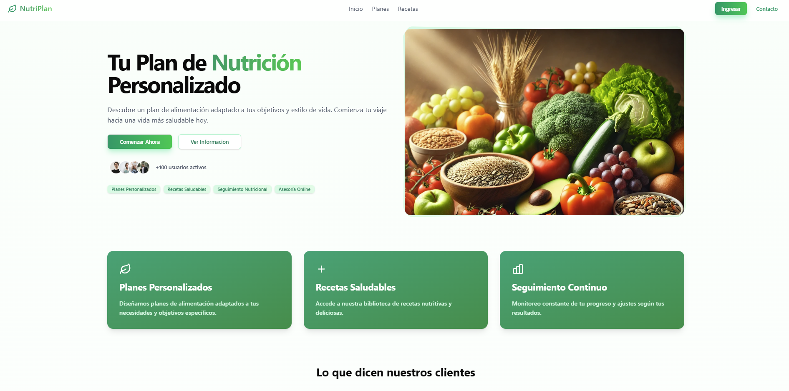
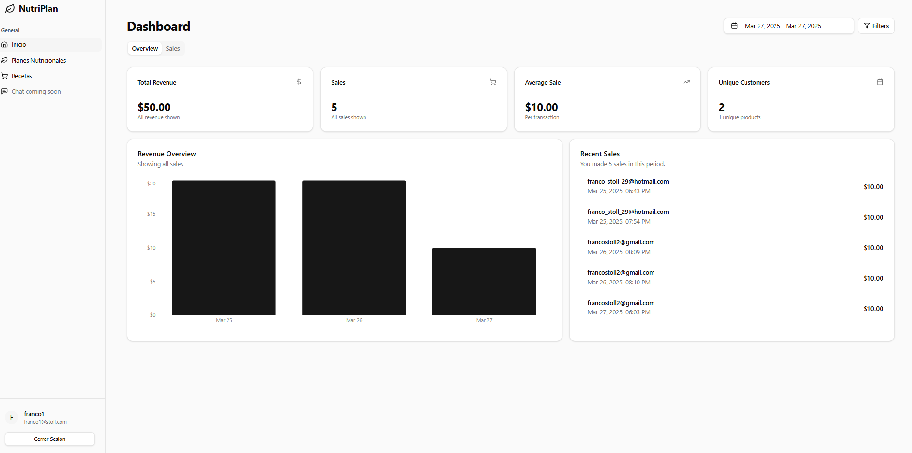
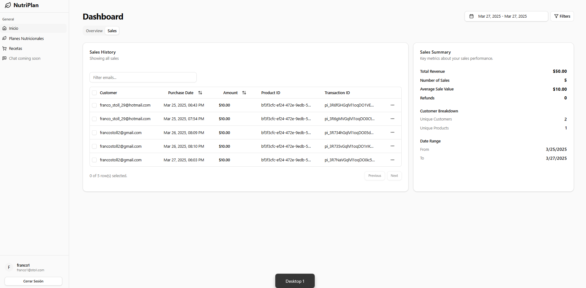
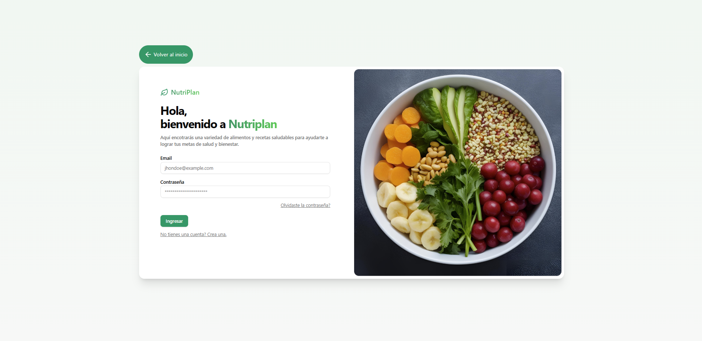
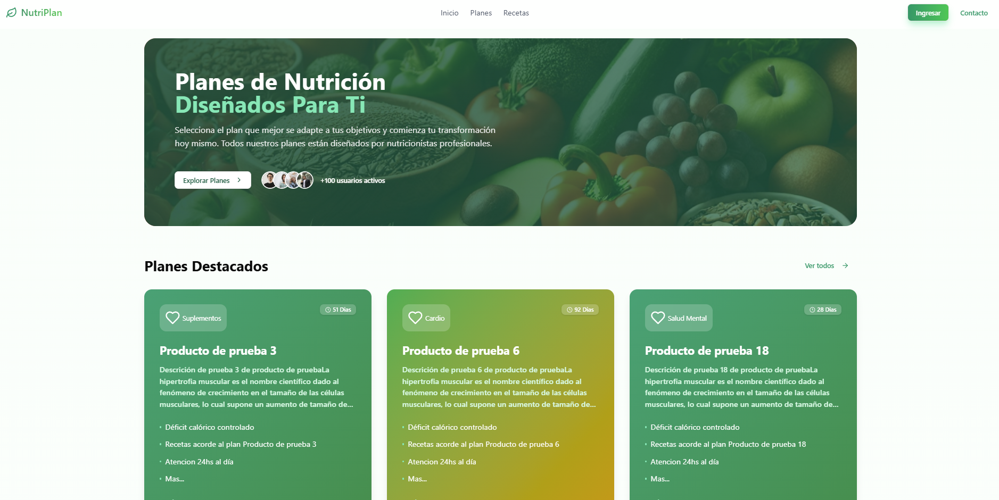
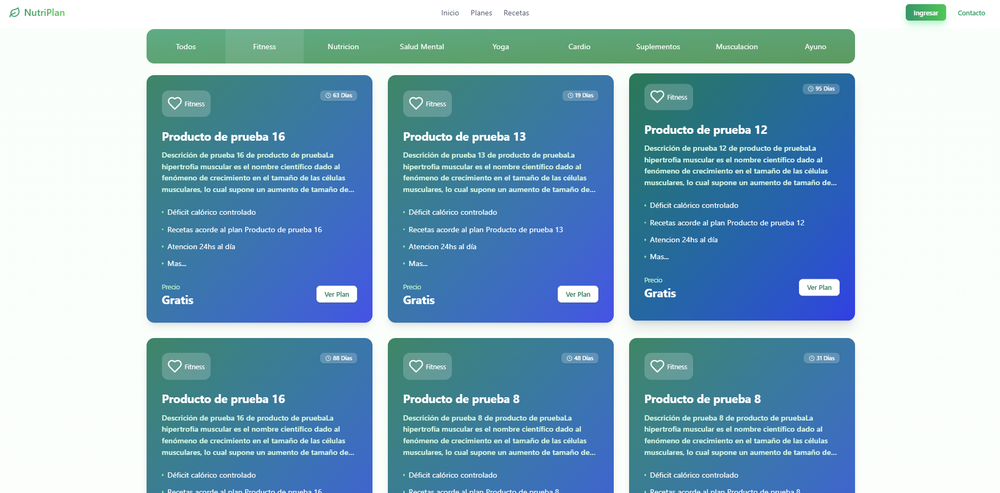

  

# Aplicación de Gestión de Productos y Compras

Esta aplicación es una plataforma diseñada para gestionar productos y compras, integrando funcionalidades como autenticación de usuarios, roles administrativos, procesamiento de pagos con Stripe, y envío de correos electrónicos con Nodemailer. Es ideal para proyectos de comercio electrónico o plataformas de contenido digital.

## Funcionalidades Principales

- **Gestión de Usuarios**: Registro, inicio de sesión y verificación de estado de usuarios.
- **Roles y Permisos**: Control de acceso basado en roles (ADMIN, USER).
- **Gestión de Productos**: Creación, actualización, eliminación y listado de productos con categorías.
- **Procesamiento de Pagos**: Integración con Stripe para pagos seguros.
- **Envío de Correos Electrónicos**: Confirmación de compras con archivos PDF adjuntos.
- **Dashboard Administrativo**: Visualización de usuarios y compras realizadas.

## Tecnologías Utilizadas

- **NestJS**: Framework backend para construir aplicaciones escalables y mantenibles.
- **Prisma**: ORM para la gestión de la base de datos.
- **SQLite**: Base de datos ligera para desarrollo.
- **Stripe**: Procesamiento de pagos.
- **Nodemailer**: Envío de correos electrónicos.
- **TypeScript**: Lenguaje principal para el desarrollo.
- **Class-Validator**: Validación de datos.
- **Multer**: Manejo de archivos para subir PDFs.
- **JWT**: Autenticación basada en tokens.
- **ESLint y Prettier**: Herramientas para mantener un código limpio y consistente.

## Cómo Ejecutar el Proyecto

1. Clona el repositorio.
2. Instala las dependencias con `npm install`.
3. Configura las variables de entorno en un archivo `.env`.
4. Ejecuta el servidor en modo desarrollo con `npm run start:dev`.

## Capturas de Pantalla

### Página Principal

### Dashboard

 

### Login
  

### Planes

 

¡Gracias por revisar este proyecto! Si tienes alguna pregunta, no dudes en contactarme.

